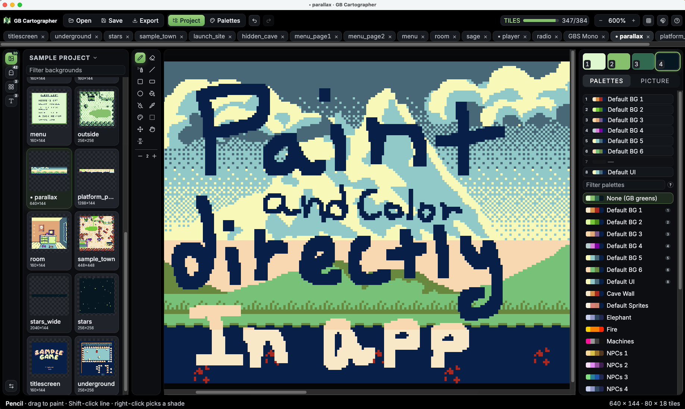
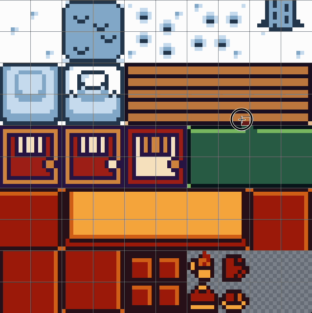
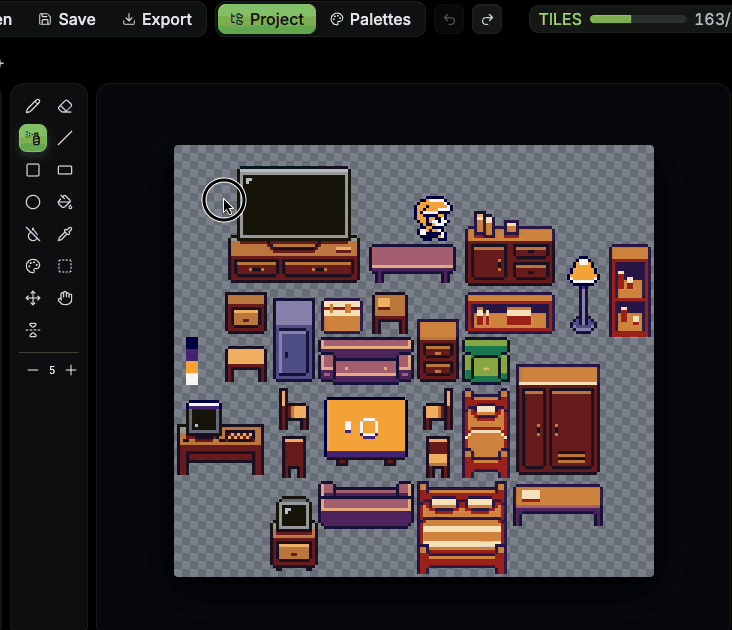
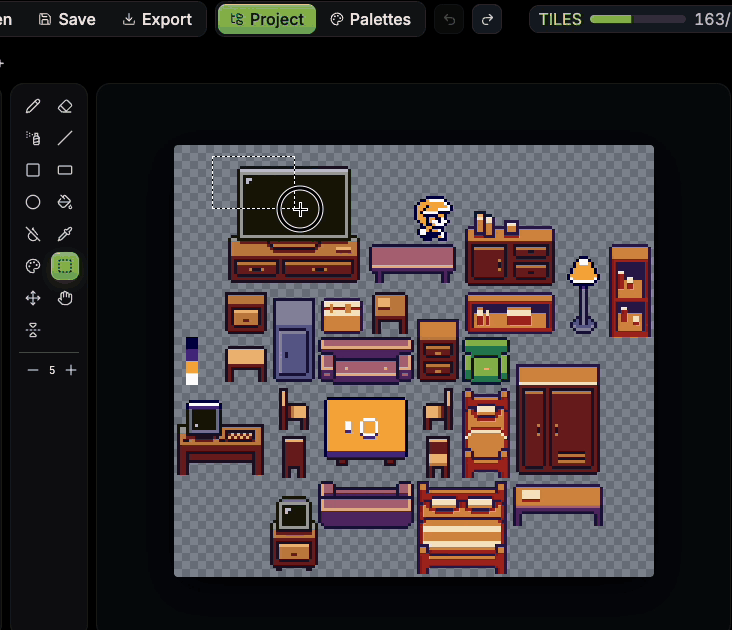

# GB Cartographer

**Alpha:** a pixel painting and color palette companion app for [GB Studio](https://www.gbstudio.dev) projects.
Paint backgrounds, sprite sheets, tilesets and fonts, give each tile its palette, and save the PNGs and per-tile
palettes straight back into the project.

> **Alpha release.** GB Cartographer is early software: features and file handling are still changing, and there
> will be bugs. It writes into your GB Studio project when you save, so keep the project backed up or in version
> control, and close GB Studio while you work. Please report problems in the repository's issues.





| Spray | Select and move | Pencil |
| :---: | :---: | :---: |
|  |  |  |

## Features

- **Open a GB Studio 4 project** (its `.gbsproj` or folder) and see its backgrounds, sprite sheets, tilesets,
  fonts, emotes, avatars and UI pictures as thumbnail cards, drawn in their real palettes. Or open any Game Boy
  PNG on its own.
- **One flat picture per file.** No layers, no tileset management: what you see is the PNG, kept in the four
  Game Boy shades, read exactly the way GB Studio reads colors. Sprite sheets and emotes keep their key green
  (`#65FF00`) for see-through pixels.
- **Paint directly with palettes.** The palette brush gives each 8 × 8 background or tileset tile (or 8 × 16
  sprite tile) one of its eight palettes, in 1, 2 × 2 or 3 × 3 tile steps, with Shift-click for straight lines and
  I to pick a tile's palette. Save writes them as GB Studio does: `tileColors`, or a sprite slice's `paletteIndex`.
- **Put a palette in a slot.** Right-click a palette (in the sidebar or the palette manager) to place it in one of
  the eight slots: the scene's palette list, or the project's default palettes. An optional named-slots rule lets
  day / night / sunset variants (`Forest-2-Trees N`) save as their base palette's slot.
- **A palette manager.** The project's palettes, a bundled library (Game Boy classics and the author's own CC0
  set) and your own, with a live preview of the open picture; add palettes to the project or edit its own, and
  see which scenes use each one (unused and duplicate palettes are marked, and an unused one can be taken out);
  import palettes from Lospec `.hex` or GIMP `.gpl` files and export your own as JSON.
- **Palettes edited in place.** Click a shade square again to change that color; Save writes the recolored
  palette back into the project, and undo brings old colors back.
- **The usual tools.** Pencil, eraser, spray, line, rectangle, ellipse, fill (Alt-click replaces a shade
  everywhere), eyedropper, select and move, flip and turn, mirror painting, brush sizes, undo, tabs, drag-and-drop,
  paste from the clipboard. Selections on tile edges take their tiles' palettes with them, even into another
  picture.
- **New pictures and resizing.** Make a new background, sprite sheet or tileset in the project, or resize one in
  whole tiles.
- **GB Studio's limits in view.** A tile counter shows unique 8 × 8 tiles against the 192 / 384 budget, and an
  overlay shows where each 160 × 144 screen falls.
- **Sprite frames and font samples.** A sprite sheet shows its animations' frames above it (and plays them at GB Studio's speed); a font
  sheet shows a sample sentence set in its own glyphs.
- **Export to share.** Any picture as shown, in its palettes, or in the greens, scaled up 2× to 8× with crisp pixels.
- **Careful with your files.** The last 10 versions of every file it overwrites, restorable from **Backups…**; a
  warning when a file changed on disk (pictures GB Studio changes reload by themselves) or GB Studio is open; and a
  short, fixed list of what it ever writes (below).
- **Works offline**, with its fonts built in. **A demo project** to try it on, with CC0 and MIT art by credited
  authors.

## Planned

- Prebuilt apps for macOS, Windows and Linux (GitHub Releases and itch.io), and a tested Windows pass.

## Screenshots


GB Studio's own sample project opened in GB Cartographer: a font sheet with its live sample sentence, and a wide
parallax background painted with its scene's palettes.


## GB Studio versions

GB Cartographer follows GB Studio: each release supports the newest GB Studio. When GB Studio changes its project
files, GB Cartographer follows in its next release, and this table says which version reads what.

| GB Cartographer | GB Studio | Project file format |
| --- | --- | --- |
| 0.1.0 (alpha) | 4.2.0 – 4.3.2 (newest checked: 4.3.2) | 4.2.0, release 10 |

A project from an older GB Studio (including GB Studio 3): open it in the newest GB Studio and save once (it
converts the project; keep a copy first), then open it here. A project saved by a newer GB Studio than the table
lists opens with a note: keep a backup and look for a GB Cartographer update.

## Try it with the demo project

The app ships with a small GB Studio 4 project in `demo/`: a winter scene, a cabin interior and a forest, a furniture
tileset, animal and snow-folk sprite sheets, four fonts, and a set of palettes. **Try the demo project** on the
start screen opens a copy of it (in the app's data folder, so the shipped copy stays clean). The art is by
Spencer "Raptorspank" Gerowe (CC0) and by GumpyFunction, yoanqwp, krümel, Paige Ashlynn, Anima
and KizulEmeraldfire from the GB Studio Community Assets repository (MIT); the full list is in
[demo/CREDITS.md](demo/CREDITS.md).

## What GB Cartographer writes into your project

GB Cartographer is careful with your game files. It only ever writes:

- the PNG you saved, under `assets/backgrounds`, `sprites`, `tilesets`, `fonts`, `emotes`, `avatars` or `ui`, with the same size as before (or the new size, after **Resize…**);
- a new PNG when you make one with **New** (it never replaces a file; GB Studio adds its own settings for it);
- the `tileColors` field of a background's or tileset's `.png.gbsres` sidecar;
- the `paletteIndex` of the slices in a sprite sheet's `.png.gbsres` sidecar;
- palette files in `project/palettes/`: a new one when you add a palette from the manager, the name and
  colors of one you edit there, or taking out one that nothing in the project uses (it goes to the backups);
- when you put a palette in a slot: that one entry of a scene's palette list (`paletteIds` or `spritePaletteIds`
  in its `scene.gbsres`), or of the project's default palettes (`defaultBackgroundPaletteIds` or
  `defaultSpritePaletteIds` in `project/settings.gbsres`);
- its own folder, `Cartographer/`, beside `assets/` and `project/`: saved stamps in `Cartographer/stamps/` (a PNG
  each, its tile palettes in a `.png.json` beside it), the Map Room's layouts in `Cartographer/maps.json`, and a
  `README.txt` saying what the folder is. GB Studio
  doesn't read this folder; it travels with your project.

Every other field of those files, and every other file in the project, is left untouched. Before each write the
old file is copied to GB Cartographer's backups folder (the last 10 versions of each file, kept per project; **Backups…** in the project menu shows them and puts one back), and a file that changed on disk
since you opened it is never overwritten without asking. GB Studio 4 projects (the folder with `assets/` and
`project/`) are supported (see GB Studio versions above). A GB Studio 3 project needs opening and saving once in GB Studio 4
first. Colors other than the four greens shade exactly as GB Studio reads them (by their green channel), and a
background with GB Studio's Automatic color asks before saving, since a save in greens would lose its colors.

## Running it

```bash
npm install
npm run desktop        # the desktop app (builds first)
npm run dev            # or the page on a local dev server, http://127.0.0.1:5173
```

In the desktop app, **Open project…** shows a file dialog: pick the project's `.gbsproj` file (or its folder). On the dev server it asks for the folder's path; you
can also set `GBC_PROJECT=/path/to/project` or write `{ "project": "/path/to/project" }` to
`cartographer.local.json` (not committed).

### Where GB Cartographer keeps its things

The desktop app keeps its settings (`settings.json`: the open project and recent ones), the demo project's copy
(`demo-project/`) and the backups (`backups/<project>-<id>/…`, the last 10 versions of every file it overwrote) in
its data folder:

| System | Data folder |
| --- | --- |
| macOS | `~/Library/Application Support/GB Cartographer` |
| Windows | `%APPDATA%\GB Cartographer` |
| Linux | `~/.config/GB Cartographer` |

**Show backups folder** in the project menu opens this project's backups. On the dev server they go to `backups/` in
the checkout instead, next to `cartographer.local.json`. Open pictures and per-window choices (font, tint, panels)
live in the app's own browser storage. Saved stamps and Map Room layouts are kept in the project itself, in its
`Cartographer/` folder, so they travel with it.

`npm run install-mac-app` puts a GB Cartographer app in /Applications that runs this checkout; `npm run install-shortcut`
does the same on Windows.

## Keys

B pencil · E eraser · S spray · L line · R rectangle · Shift+R filled · O ellipse · G fill · Shift+G flood erase ·
I pick shade · P palette brush · M select · V move · H pan (or Space) · 1–4 shades · 0 see-through · [ ] brush size ·
Shift+M mirror · Ctrl+O open · Ctrl+S save · Ctrl+E export copy · Ctrl+Z / Ctrl+Shift+Z undo / redo ·
Ctrl+C / X / V · Ctrl+A · Ctrl+= / Ctrl+- zoom · Esc drop the selection.

## Checks

```bash
npm test
npm run build
```

## Credits and license

Code: MIT (see LICENSE). The logo is the author's pixel art, CC0. [Public Pixel](https://ggbot.itch.io/public-pixel-font)
by GGBotNet (CC0, shipped in `public/fonts/`) is an optional UI font. Inter by Rasmus Andersson and the Inter Project Authors, and JetBrains Mono by JetBrains, ship with the app (SIL Open Font License 1.1, licences in `public/fonts/`).
The demo project's art is credited in [demo/CREDITS.md](demo/CREDITS.md). The main screenshot and the font and wide-background screenshots show GB
Studio's sample project (`appData/templates/gbs2` in the [GB Studio repository](https://github.com/chrismaltby/gb-studio)),
Copyright (c) 2019-2026 Chris Maltby, used under the MIT license. GB Studio is by Chris Maltby and
contributors; GB Cartographer is not affiliated with it.
