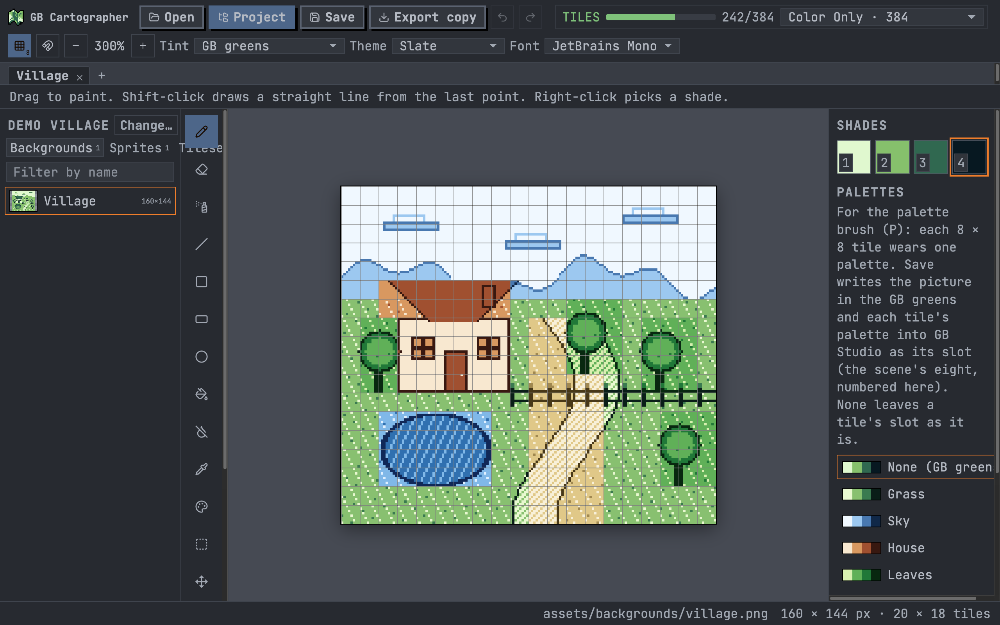
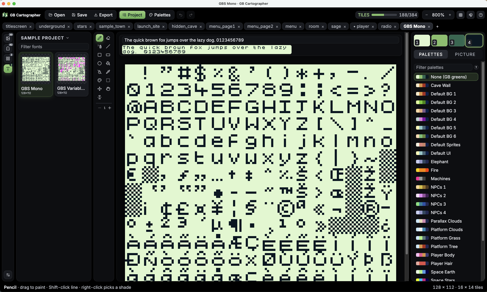

# GB Cartographer

A small pixel painter for [GB Studio](https://www.gbstudio.dev) projects. Open your project folder and paint its
backgrounds, sprite sheets, tilesets and fonts in the four Game Boy shades, give tiles their palettes, and save straight
back into the project. It also opens any Game Boy PNG on its own.



- **One flat picture per file.** No layers, no tileset management: what you see is the PNG.
- **GB Studio's own rules.** Pictures stay in the four greens; sprite sheets keep their key green (`#65FF00`)
  for see-through pixels; a tile counter shows unique 8 × 8 tiles against the 192 / 384 budget.
- **Palettes that GB Studio sees.** Each 8 × 8 background tile, or 8 × 16 sprite tile, can wear one of the eight
  palettes its scene uses. Save writes them into the project exactly as GB Studio does: a background's
  `tileColors`, a sprite's `paletteIndex`.
- **The usual tools.** Pencil, eraser, spray, line, rectangle, ellipse, fill, eyedropper, select and move,
  mirror painting, brush sizes, undo, tabs, drag-and-drop, paste from the clipboard.
- **Palettes edited in place.** Click the selected shade square again to change that color; Save writes the
  recolored palette back into the project. If GB Studio is open, reload the project there afterwards, or close it
  first: it writes the project back when it saves.
- **A palette manager.** The project's palettes, a bundled library (Game Boy classics and the author's own
  Chorbi set) and your own, with a live preview of the open picture; add palettes to the project or edit the
  project's in place.
- **Dark themes**, including ones built from Game Boy palettes, and a choice of fonts.

GB Studio's own sample project opened in GB Cartographer: a font sheet with its live sample sentence, and a wide
parallax background painted with its scene's palettes.




## Try it with the demo project

The app ships with a small GB Studio 4 project in `demo/`: a winter scene, a cabin interior and a forest, a furniture
tileset, animal and snow-folk sprite sheets, six fonts, and a set of palettes. **Try the demo project** on the
start screen opens a copy of it (in the app's data folder, so the shipped copy stays clean). The art is by
Spencer "Raptorspank" Gerowe (CC0) and by GumpyFunction, yoanqwp, krümel, Paige Ashlynn, Anima, Santiago Crespo
and KizulEmeraldfire from the GB Studio Community Assets repository (MIT); the full list is in
[demo/CREDITS.md](demo/CREDITS.md).

## What GB Cartographer writes into your project

GB Cartographer is careful with your game files. It only ever writes:

- the PNG you saved, under `assets/backgrounds`, `assets/sprites`, `assets/tilesets` or `assets/fonts`, with the same size as before;
- the `tileColors` field of a background's `.png.gbsres` sidecar;
- the `paletteIndex` of the slices in a sprite sheet's `.png.gbsres` sidecar;
- palette files in `project/palettes/`: a new one when you add a palette from the manager, or the name and
  colors of one you edit there.

Every other field of those files, and every other file in the project, is left untouched. Before each write the
old file is copied to GB Cartographer's backups folder (one previous version per file), and a file that changed on disk
since you opened it is never overwritten without asking. GB Studio 4 projects (the folder with `assets/` and
`project/`) are supported.

## Running it

```bash
npm install
npm run desktop        # the desktop app (builds first)
npm run dev            # or the page on a local dev server, http://127.0.0.1:5173
```

In the desktop app, **Open project…** shows a file dialog: pick the project's `.gbsproj` file (or its folder). On the dev server it asks for the folder's path; you
can also set `GBC_PROJECT=/path/to/project` or write `{ "project": "/path/to/project" }` to
`cartographer.local.json` (not committed). Backups go to the app's data folder (desktop) or `backups/` (dev server).

`npm run install-mac-app` puts a GB Cartographer app in /Applications that runs this checkout; `npm run install-shortcut`
does the same on Windows.

## Keys

B pencil · E eraser · S spray · L line · R rectangle · Shift+R filled · O ellipse · G fill · Shift+G flood erase ·
I pick shade · P palette brush · M select · V move · H pan (or Space) · 1–4 shades · 0 see-through · [ ] brush size ·
Shift+M mirror · Ctrl+O open · Ctrl+S save · Ctrl+E export copy · Ctrl+Z / Ctrl+Shift+Z undo / redo ·
Ctrl+C / X / V · Ctrl+A · Ctrl+= / Ctrl+- zoom · Esc drop the selection.

## Checks

```bash
npm test
npm run build
```

## Credits and license

Code: MIT (see LICENSE). The logo is the author's pixel art, CC0. [Public Pixel](https://ggbot.itch.io/public-pixel-font)
by GGBotNet (CC0, shipped in `public/fonts/`) is an optional UI font. Inter by Rasmus Andersson and JetBrains Mono are loaded from Google Fonts (SIL Open Font License 1.1).
The demo project's art is credited in [demo/CREDITS.md](demo/CREDITS.md). The second and third screenshots show GB
Studio's sample project (`appData/templates/gbs2` in the [GB Studio repository](https://github.com/chrismaltby/gb-studio)),
Copyright (c) 2019-2026 Chris Maltby, used under the MIT license. GB Studio is by Chris Maltby and
contributors; GB Cartographer is not affiliated with it.
